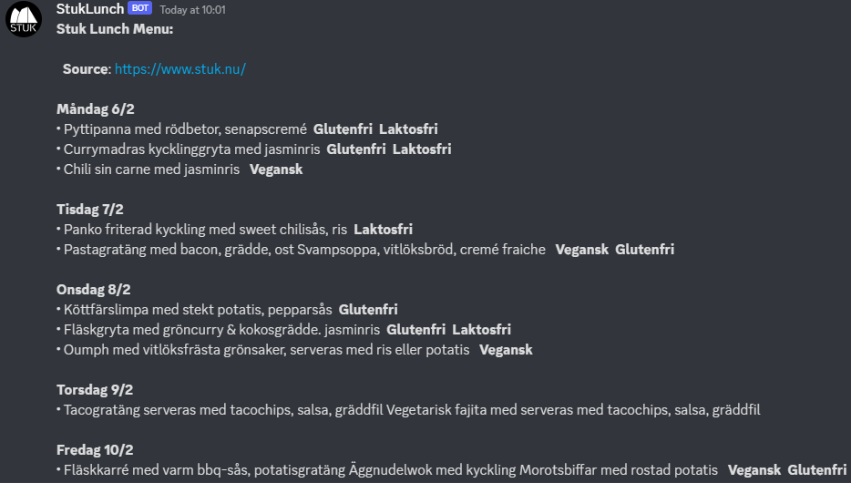
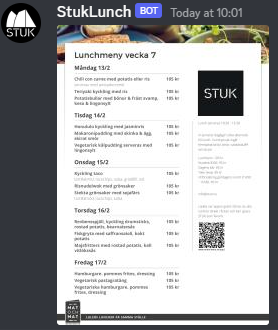

# STUK Lunch Discord Bot

This is a simple Discord bot that fetches the daily menu from the website [STUK](https://www.stuk.nu/) or [Matochmat](https://www.matochmat.se/lunch/lulea/stuk/) using various librarys and formats to post the menu to a Discord channel upon command. 


## DEMO
<center>
<p float="left">
  
   
</p>
</center>

## Features
- Displays the restaurant's menu
    - As text output
    - As an image (jpg)
- Lists all the commands the bot has
- Shows the url from which the menu was taken

## Installation
1. Clone the repository using 
``` 
git clone https://github.com/VictorLongberg/stuk-lunch-discord-bot.git
```
2. Make sure you have installed the required library dependencies:
- `discord.py`
- `requests_html`
- `requests` 
- `pdf2jpg`

If not, run
 ```
 pip install discord.py requests_html requests pdf2jpg
 ``` 
3. Navigate to the cloned repository and create a new file called `.env` in the project root folder
```
📦STUK-Lunch-Discord-Bot
 ┣ 📂commands
 ┃ ┣ 📜help.py
 ┃ ┣ 📜menu.py
 ┃ ┣ 📜pdf.py
 ┃ ┗ 📜url.py
 ┣ 📂pdf
 ┣ 📂utils
 ┃ ┣ 📜build_url.py
 ┃ ┣ 📜delete_all_user.py
 ┃ ┗ 📜get_menu_text.py
 ┣ 📜.env 🡐
 ┣ 📜.gitattributes
 ┣ 📜.gitignore
 ┣ 📜bot.py
 ┣ 📜config.py
 ┣ 📜LICENSE
 ┣ 📜README.md
```
4. Setup a discord bot in your own channel using this code using [discords](https://discordpy.readthedocs.io/en/stable/discord.html) instruction and generate a discord bot token.
5. In the `.env` file, add your Discord bot token like this: `SECRET_KEY_DISCORD=your_token_here`
6. Run the script using `python bot.py` in the STUK-LUNCH-DISCORD-BOT directory

## Usage
Once the bot is running and added to your Discord server, you can use the following commands to interact with it:

- `!menu` - Displays the restaurant's menu
- `!help` - Lists all the commands the bot has
- `!url` - shows the url from which the menu was taken
- `!pdf` - shows the menu from the resturant as an image


## Versions
- python-dotenv==0.21.0
- discord==2.1.0
- discord.py==2.1.0
- pdf2jpg==1.1
- requests==2.28.2
- requests-file==1.5.1
- requests-html==0.10.0

## Contribution
Feel free to contribute to this project by submitting pull requests.

## License
This project is licensed under the MIT License - see the [LICENSE](LICENSE) file for details.

## Acknowledgment
* [STUK](https://www.stuk.nu/) for providing the menu data
* [Matochmat](https://www.matochmat.se/lunch/lulea/stuk/) for providing the alternativ menu data
* [Discord API](https://discord.com/developers/docs/intro) for providing the Discord bot functionality
* [requests_html](https://requests.readthedocs.io/projects/requests-html/en/latest/) for making it easy to scrape the menu from the website